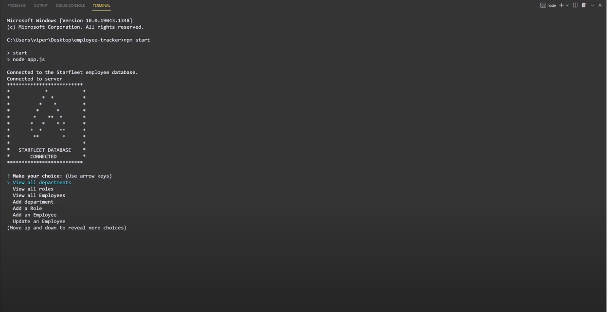
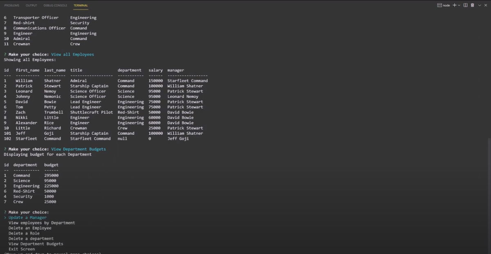

# SQL Employee Tracker App

## Table of contents 

- [Description](#Description)
- [Technology Used](#Technology-used)
- [Installation](#Installation)
- - [Database](#Database)
- [Pictures](#Pictures)
- [Contributing](#Contributing)
- [Questions](#Questions)

## Description 

This is my Employee Tracker SQL command line application loosely styled after Star Trek, because why not have a little fun with your personal projects?

The purpose of the application is to manage Departments, Roles in the company, and the Employees.  
When you start the application you are presented with the following options:  
view all departments, view all roles, view all employees, add a department, add a role, add an employee, update an employee role, update the manager for an employee, delete employee, delete role, and delete department.

You can view a quick demo video of it in aciton here: [https://youtu.be/fOS-62uyrvs](https://youtu.be/fOS-62uyrvs)

I hope you enjoy using it as much as I enjoyed making it.

## Technology used

- console.table 0.10.0
- express 4.17.1
- inquirer 8.2.0
- mysql2 \*
- nodemon 2.0.15 (used briefly for testing)

## Installation

You can start by downloading the program from this repository: [https://github.com/JeffGoji/sql-employee-tracker](https://github.com/JeffGoji/sql-employee-tracker).  
Navigate to your folder you saved the file and run your command terminal and install the following:

- npm install inquirer
- npm install mysql
- npm install console-table

Run "npm start" to start the application and enjoy!

## Database

The database uses three tables, here is the schema:

> SELECT \* FROM employee_db.role;
>
> CREATE TABLE `department` (
> `id` int NOT NULL AUTO_INCREMENT,
> `name` varchar(60) NOT NULL,
> PRIMARY KEY (`id`)
> ) ENGINE=InnoDB AUTO_INCREMENT=18 DEFAULT CHARSET=utf8mb4 COLLATE=utf8mb4_0900_ai_ci
>
> CREATE TABLE `employee` (
> `id` int NOT NULL AUTO_INCREMENT,
> `first_name` varchar(30) NOT NULL,
> `last_name` varchar(30) NOT NULL,
> `role_id` int DEFAULT NULL,
> `manager_id` int DEFAULT NULL,
> PRIMARY KEY (`id`),
> KEY `role_ind` (`role_id`),
> KEY `manager_ind` (`manager_id`),
> CONSTRAINT `fk_manager` FOREIGN KEY (`manager_id`) REFERENCES `employee` (`id`) ON DELETE SET NULL,
> CONSTRAINT `fk_role` FOREIGN KEY (`role_id`) REFERENCES `role` (`id`) ON DELETE SET NULL
> ) ENGINE=InnoDB AUTO_INCREMENT=103 DEFAULT CHARSET=utf8mb4 COLLATE=utf8mb4_0900_ai_ci
>
> CREATE TABLE `role` (
> `id` int NOT NULL AUTO_INCREMENT,
> `title` varchar(45) NOT NULL,
> `salary` decimal(6,0) DEFAULT NULL,
> `department_id` int DEFAULT NULL,
> PRIMARY KEY (`id`)
> ) ENGINE=InnoDB AUTO_INCREMENT=31 DEFAULT CHARSET=utf8mb4 COLLATE=utf8mb4_0900_ai_ci COMMENT='Employee Role'

## Pictures

## Contributing

Feel free to contact me about contributing to this project. :)

## Questions

If you have any questions about the repo, open an issue or contact me directly at jeff.lester@outlook.com.
You can find more of my work at [https://github.com/jeffgoji](https://github.com/jeffgoji)

[Back to top](#top)
